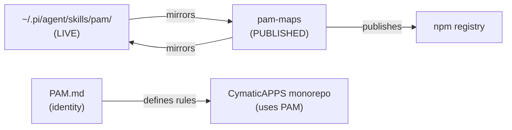

# 📖 ReadMyAss — pam-maps

> Human-readable explanation of `pam-maps` and its place in CymaticAPPS.
> For the visual map see [`PAM_Slave.md`](./PAM_Slave.md).
> For global significance see [`ASS_SLAVE.md`](./ASS_SLAVE.md).
> For project-internal significance see [`PASS.md`](./PASS.md).

**Last synced:** `2026-05-29`

## *You Are Here*

```
🗺️  CymaticAPPS  ─── (Master Map: ../../../.pi/MAPS/ReadMyAss.md)
    ├── ⚙️ Meta / Scaffolding
    │   ├── pam-maps            ◀── *YOU ARE HERE*
    │   ├── (CI/CD, build tools)
    │   └── ...
    └── ...
```

## What is pam-maps?

**PAM (Project Architectural Maps) productized into a shippable, distributable npm package.**

pam-maps is **PAM dogfooding itself** — it is both:

1. **The published version of PAM** — a standalone npm package that teams can install and use to map their own monorepos
2. **The source of truth for the live Pi copy** — `~/.pi/agent/skills/pam/` and `~/.pi/agent/agents/PAM.md` are mirrors of this repo (they must stay synced)

The package provides:

- **`PAM.md` identity doc** — vocabulary, rules, and philosophy
- **`/pam` skill** — workflow for running PAM inside any AI agent (Pi, Claude Code, Codex, Cursor, etc.)
- **4 templates** — for Master-layer (`ASS_MASTER.md`, `ReadMyAss.md`, `PAM_Master.md`) and Slave-layer files (`ASS_SLAVE.md`, `ReadMyAss.md`, `PAM_Slave.md`, `PASS.md`)
- **3 CLI scripts** — for scanning monorepos (`scan-readmes.mjs`), fetching third-party repo readmes (`fetch-repo-readme.mjs`), and logging pending changes (`log-pending.mjs`)
- **Pre-commit hook** — warns when ASS-significant files are changed

## How pam-maps relates to the rest of CymaticAPPS



### In plain English

- **pam-maps is PAM's public distribution** — anyone can `npm install -g pam-maps` and map their monorepo
- **The live Pi copy must stay in sync** — `~/.pi/agent/skills/pam/` and `pam-maps/` in CymaticAPPS are mirrors; changes to one must sync to the other
- **It is load-bearing for the CymaticAPPS monorepo** — the master maps (PAM_Master.md, etc.) at `CymaticAPPS/.pi/MAPS/` are generated using pam-maps templates and scripts
- **It is a tool for other teams** — published to npm, available to anyone who wants to map their monorepo architecture
- **It has zero runtime dependencies** — does not consume other CymaticAPPS services or integrations

## How to run / use

### As an npm global tool

```bash
npm install -g pam-maps

# Scan your monorepo
pam-scan /path/to/your/monorepo

# Evaluate a third-party repo
pam-fetch https://github.com/expressjs/express

# Log a pending change
pam-log --project my-api --type contract-change \
        --summary "Changed default port from 3000 to 8080" \
        --ripple "frontend, reverse-proxy"
```

### As a Pi skill

```bash
# Install into Pi
pi install npm:pam-maps

# Inside a Pi session
/pam status
/pam sync
/pam sync <project>
/pam evaluate <github-url>
```

### As a Claude Code / Codex / Cursor extension

```bash
cp -r skills/ ~/.claude/skills/      # Claude Code
cp -r skills/ ~/.codex/skills/       # Codex
cp -r skills/ ~/.cursor/skills/      # Cursor
```

Then use `/pam` slash commands inside those agents.

## Where to go next

| If you want to... | Read this |
|-------------------|-----------|
| See what affects the global system | [`ASS_SLAVE.md`](./ASS_SLAVE.md) |
| See what's internally important | [`PASS.md`](./PASS.md) |
| See the visual file map | [`PAM_Slave.md`](./PAM_Slave.md) |
| Go back to the monorepo overview | `../../../.pi/MAPS/ReadMyAss.md` |
| Understand the PAM vocabulary | `../../agents/PAM.md` |
